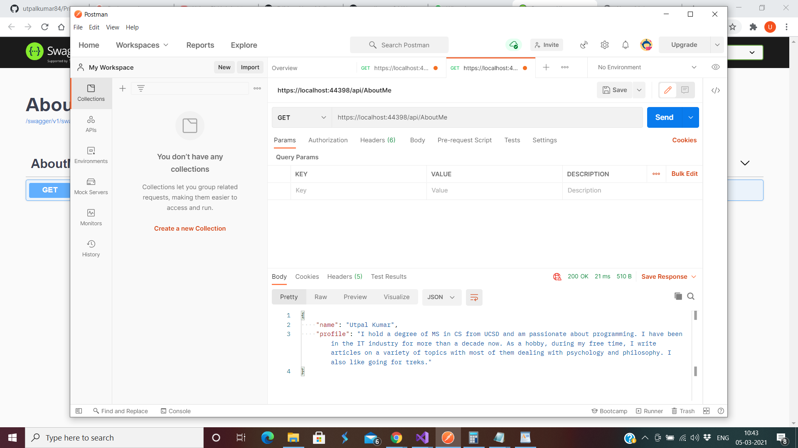
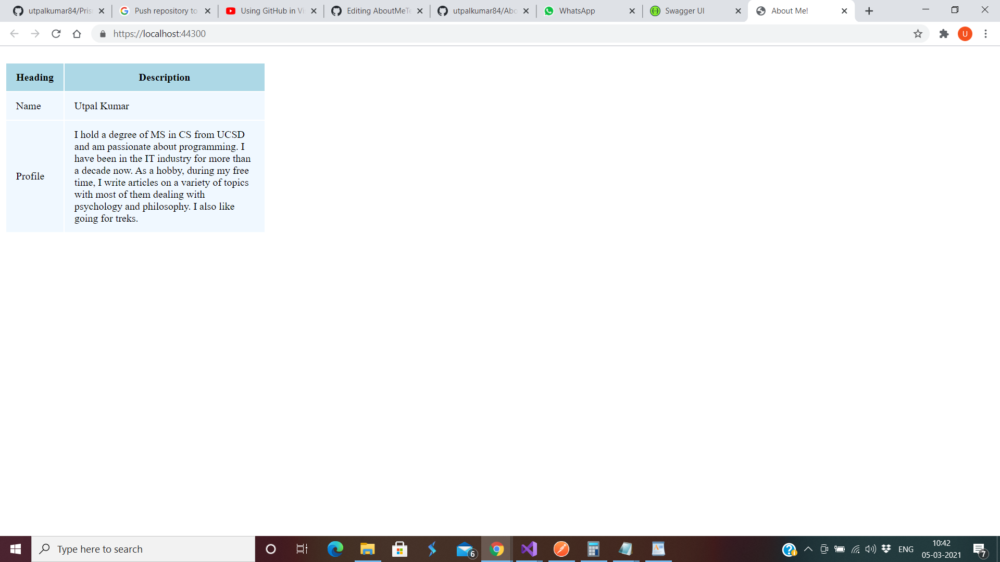

# AboutMe
## Steps to run the project (The project uses netcore 5.0)

#### 1> Clone the repository in VS 2019
#### 2> Go to solution properties
	a> Select Multiple Startup projects
		a.1> Select Start without debugging in AboutMe.API
		a.2> Select Start without debugging in AboutMe.Presentation
#### 3> Run the project
	a> Select Yes if you trust the IIS Express SSL certificate.
	b> Select Yes if you agree to trust the development certificate.
	

